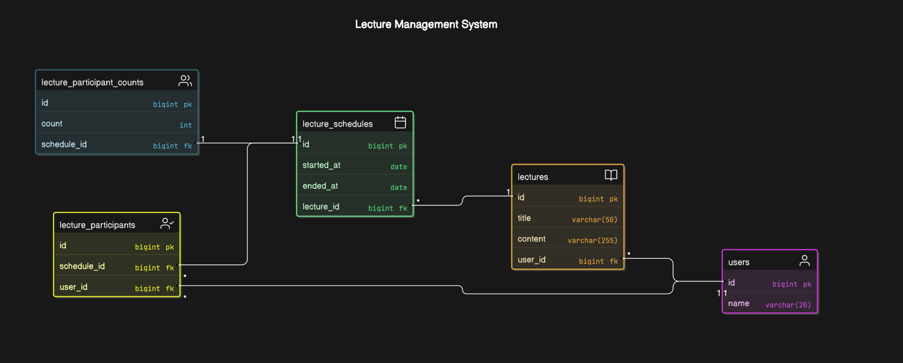

# 특강 신청 시스템

## 요구사항 정리

```text
💡  📄 → 비즈니스 규칙 정의
    🖥️ → 기술적인 내용 정의
```

### 특강 관리 시스템 규칙

- 특강 관리 시스템에서 사용자는 누구나 학생이 될 수 있고 강사가 될 수 있다.
- 특강은 제목, 내용, 강사를 가지며, 여러개의 스케줄을 가질 수 있다.
- 특강은 특강을 진행하는 사용자를 강사로 지칭하며 특강에는 강사가 무조건 존재해야 한다. (유저로 생성되어 있어야 특강을 생성할 수 있다고 가정한다.)
- 특특강 정원은 30명 고정이며, 사용자는 각 특강에 신청하기 전에 목록을 조회할 수 있어야 합니다.
- 같은 사용자에게 여러 번의 특강 슬롯이 제공되어서는 안됩니다.

### 기능 별 정의

- 사용자는 특강을 신청할 수 있다.
    - `📄` 특강을 신청할 때 서비스에 가입된 사용자만 특강을 신청할 수 있다.
        - `🖥️`현재 회원가입, 로그인은 없기 때문에 DB에 존재하는 사용자인지 여부만으로 판단합니다.
    - `📄`같은 사용자가 동일한 특강을 신청할 수 없다.
    - `📄`실제 존재하는 특강만 신청할 수 있습니다.
    - `📄`강사는 특강 신청을 할 수 없습니다.
    - `📄`30명의 사용자만 특강 신청 가능하며, 초과되면 이후의 신청자는 요청이 실패합니다.
    - `📄`이미 일자가 지난 특특강 경우 신청할 수 없습니다.
    - `📄`신청은 승인 과정없이 바로 성공한다고 가정합니다.
    - `🖥️`해당 API는 다음과 같이 요청을 정의한다.

        ```json
        // POST /api/lectures/{lectureId}/schedules/{scheduleId}/participants
        
        {
        	"userId": number // ex. 1
        }
        ```

    - `🖥️`해당 API는 정보를 응답하지 않습니다.
- 사용자는 특강 신청 가능 목록을 조회할 수 있다.
    - `📄`서비스 사용자가 아니더라도 특강 목록을 조회할 수 있습니다.
    - `📄`특정 날짜를 입력받아 해당하는 날짜의 특강 목록을 조회합니다.
    - `📄`해당 날짜에 특강이 없는 경우 빈 리스트가 반환됩니다.
    - `📄`조회시 기본적으로 10개를 조회하며, 페이지네이션을 지원합니다.
    - `🖥️`페이지네이션은 오프셋 기반으로 진행한다.
    - `🖥️`API 요청은 다음과 같이 정의한다.

        ```json
        // /api/lectures?size=10&date=2024-12-24
        ```

    - `🖥️`API 응답은 다음과 같이 정의한다.

        ```json
        {
        	"lectures": [
        		{
        			"lectureId": number // 1
        			"scheduleId": number // 1
        			"title": string // "자바 메모리 구조 특강"
        			"content": string // "JVM 메모리 구조에 대해 알아보는 특강입니다."
        			"teacher": string // "홍길동"
        			"participantCounts": number // 현재 수강 인원
        			"startedAt": datetime // "2024-12-22 14:00"
        			"endedAt": datetime // "2024-12-22 15:00"
        		},
        		{
        			"lectureId": number // 1
        			"scheduleId": number // 2
        			"title": string // "자바 메모리 구조 특강"
        			"content": string // "JVM 메모리 구조에 대해 알아보는 특강입니다."
        			"teacher": string // "홍길동"
        			"participantCounts": number // 현재 수강 인원
        			"startedAt": datetime // "2024-12-22 14:00"
        			"endedAt": datetime // "2024-12-22 15:00"
        		},
        		....
        		"hasNext": false
        	]
        	
        }
        ```


- 특강 신청 완료 목록 조회를 할 수 있다.
    - `📄`특강 신청이 없는 경우 빈 리스트가 반환된다.
    - `📄`서비스에 가입하지 않은 사용자인 경우 에러가 발생한다.
    - `📄`조회시 기본적으로 10개를 조회하며, 페이지네이션을 지원합니다.
        - `🖥️`API 요청은 다음과 같이 정의합니다.

            ```json
            // /api/user/{userId}/lectures?size=10
            ```

        - `🖥️`API 응답은 다음과 같이 정의합니다.

            ```json
            {
                "lectures": [
                    {
                        "lectureId": number // 1
                        "scheduleId": number // 1
                        "title": string // "자바 메모리 구조 특강"
                        "content": string // "JVM 메모리 구조에 대해 알아보는 특강입니다."
                        "teacher": string // "홍길동"
                        "participantCounts": number // 현재 수강 인원
                        "startedAt": datetime // "2024-12-22 14:00"
                        "endedAt": datetime // "2024-12-22 15:00"
                    },
                    {
                        "lectureId": number // 1
                        "scheduleId": number // 2
                        "title": string // "자바 메모리 구조 특강"
                        "content": string // "JVM 메모리 구조에 대해 알아보는 특강입니다."
                        "teacher": string // "홍길동"
                        "participantCounts": number // 현재 수강 인원
                        "startedAt": datetime // "2024-12-22 14:00"
                        "endedAt": datetime // "2024-12-22 15:00"
                    },
                    ....
                    "hasNext": false
                ]
                
            }
            ```

## ERD 설계

### 1. ERD 다이어그램



### 2. 각 테이블의 역할 및 설계 이유

- `lectures` : 특강 정보를 관리하는 테이블로, 진행하는 특강 정보를 저장합니다.
    - 외래키(fk)로 user_id를 사용하여 강사 정보를 참조합니다.
    - 특특강 제목, 내용, 강사 정보를 한곳에 관리하여 특강에 변경이 생겼을때 한번에 변경될 수 있도록 스케줄 정보와 분리했습니다.
- `lecture_schedules` : 특강 일정 정보를 관리하는 테이블로, 특특강 시작일과 종료일을 관리합니다.
    - 외래키로 lecture_id를 사용하여 특정 특강(lectures)에 대한 일정 데이터를 연계할 수 있도록 설계했습니다.
    - 하나의 특강에 여러개의 스케줄을 가질 수 있도록 특강 테이블에 1:N 관계로 정의했습니다.
- `users` : 사용자 정보를 관리하는 테이블로, 사용자의 정보를 저장합니다.
- `lecture_participants` : 특강 참가자 정보를 관리하는 테이블로, 특강에 참가한 사용자 정보를 저장합니다.
    - 외래키로 schedule_id와 user_id를 설정하여 특강에 참여하는 사용자 정보를 관리합니다.
    - 한 사용자가 여러 특강 일정에 참여하거나, 하나의 특강 일정에 여러 사용자가 참여할 수 있는 N:M 관계를 관리합니다.
- `lecture_participant_counts` : 특강 참가자 수를 관리하는 테이블로, 특강에 참가한 사용자 수를 저장합니다.
    - 외래키로 schedule_id를 설정하여 특강 일정에 참여한 사용자 수를 관리합니다.
    - 별도의 테이블로 관리함으로써 비관적 락 범위를 줄이고, 성능을 향상시킬 수 있도록 설계했습니다.

### 3. lecture_participant_counts 라는 테이블로 참가자 수를 관리하는 이유

- 별도의 테이블을 사용하지 않고 관리하는 경우 다음과 같은 방법을 사용할 수 있습니다.
    - 참가자 수를 lecture_schedules 테이블에 칼럼으로 추가하는 방법
    - 참가자와 일정 간의 관계를 저장하는 lecture_participants 테이블에서 COUNT를 직접 조회하는 방법

이 경우 다음과 같은 문제가 발생할 수 있습니다.

1. lecture_participants 테이블에 대한 COUNT 연산

- 참가자 수를 매번 조회할 때 마다 lecture_participants 테이블에 대해 COUNT 연산을 수행해야 합니다.
    - 많은 사용자가 동시에 등록하거나 조회하는 경우, 쿼리가 반복적으로 실행되면서 성능 저하가 발생할 수 있습니다.
- lecture_participants 테이블의 경우 락을 걸 대상이 없기 때문에 동시성 제어가 어려울 수 있습니다.

2. lecture_schedules에 참가자 수 칼럼 추가
    - 동시성 제어를 위해 lecture_schedules 테이블에 락을 걸게 되면 참가자 수 외의 이유로 데이터를 변경하려고 할때 락으로 인해 대기하게 되면서 병목현상이 발생할 수 있습니다.

lecture_participant_counts을 따로 둘때 다음과 같은 이점이 있다고 생각하여 설계했습니다.

- 비관적락 범위를 줄여 락으로 인한 성능 저하를 최소화할 수 있습니다.
  - 참가자 수 정보만 존재하기 때문에 다른 정보 수정시에는 영향을 받지 않아 락으로인한 대기를 최소할 수 있습니다.